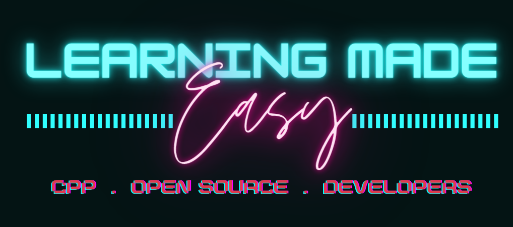

 <!-- Banner -->

  

## 📌 Introduction

The project, ***Learning Made Easy*** has been designed for the convenience of students who are planning for the preparation of any kind of examination. It will help them to understand how to study different subjects,  and the topics within them and how much time should they give to everything and keeps a track of their learning rate of each student and hence personalise their experiences as well, so that it can optimize the time assigned for learning each subject in future. It will help you build a deeper knowledge about Data Structure and Algorithms and understand their applications in our life in a more efficient manner. It aims at scheduling the studies for maximizing marks during exams. Most students face this problem during exams that what to study to get the best out of their limited time. Also it helps the early beginners to start with the most important subjects so that they have enough time for the most important subjects and then if time permits they can go ahead with less important subjects. Apart from this, it schedules the subjects as the way user wants to. 

 

## ⭐ How to get started?
  
You can refer to the following articles on the basics of Git and Github and also contact the Project Mentors, in case you are stuck:

- [Watch this video to get started, if you have no clue about open source](https://youtu.be/SL5KKdmvJ1U)
- [Forking a Repo](https://help.github.com/en/github/getting-started-with-github/fork-a-repo)
- [Cloning a Repo](https://help.github.com/en/desktop/contributing-to-projects/creating-a-pull-request)
- [How to create a Pull Request](https://opensource.com/article/19/7/create-pull-request-github)
- [Getting started with Git and GitHub](https://towardsdatascience.com/getting-started-with-git-and-github-6fcd0f2d4ac6)
- [Join the workspace to join the community of contributors](https://join.slack.com/t/opensourcecon-q6c3969/shared_invite/zt-kkqg4h5t-G3euksLSmBI4PJ3lg6WbrA)

 

## ⭐ Language Used:

C++ 

 

## ⭐ Basic Functionalities:

To schedule the exams for a very short period of time I.e. 1-2 days for the students who begin to study just before the day of the exam and complete syllabus in a very short time.

To schedule the exam time study for students subject wise who start their studies one or two week before the exams so they complete their syllabus of each subject in time.

To schedule the exam time study for students who begin to study quite early I.e. almost a month ago and have enough time to do everything in the syllabus. Also they have no time issue.

 

## ⭐ Algorithm used:

Fractional Knapsack Algorithm: Fractional Knapsack algorithm is used in order to find the chapters to be done on the basis of their weightage so as to maximize marks in limited amount of time.

Job Scheduling Algorithm: This algorithm is implemented so that the user inputs the subjects he/she has to study with the date of exams of the respective subjects and respective priorities. So they get the sequence of subjects as ouput for effective ways of study and managing time.

 

## ⭐ Real Life Application: 

A most common problem faced by students during exams is of time management and its utilization.It can help students to effectively manage their time during exams by giving them a sequence in which the should study in order to maximize marks.

 

## 💥 How to Contribute?

- Take a look at the Existing [Issues](https://github.com/anushka23g/Learning-Made-Easy/issues) or create your own Issues!
- Wait for the Issue to be assigned to you after which you can start working on it.
- Fork the Repo and create a Branch for any Issue that you are working upon.
- Create a Pull Request which will be promptly reviewed and suggestions would be added to improve it.
